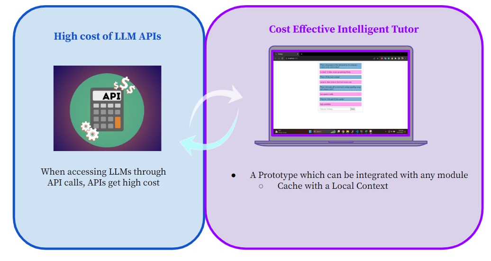
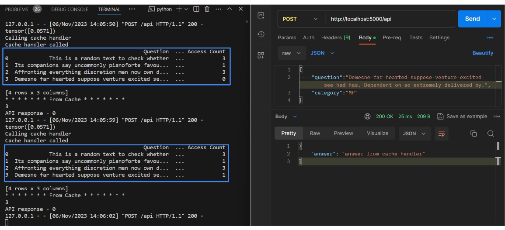

[comment]: # "This is the standard layout for the project, but you can clean this and use your own template"

# Large Language Models in Education

## Table of content

1. [Introduction](#introduction)
2. [Problem & Solution](#Problem&Solution)
3. [Related Works](#relatedwork)
4. [Methodology](#methodology)
5. [Experiments & Results Analysis](#experimentsandresultsanalysis)
6. [Conclusion](#conclusion)
8. [Team](#team)
9. [Supervisors](#supervisors)
10. [Links](#links)

## Introduction
In the last few years, artificial intelligence has advanced significantly, particularly in the fields of generative AI and large language models (LLMs). These cutting-edge models have proven to be exceptionally capable of reading, writing, and producing content that is human-like, opening up new horizons in creativity and invention. These generative AI models provide fascinating prospects in the field of education where technology integration is becoming more common. Intelligent tutoring systems have been sought after in education for a long time to improve and customize students’ learning experiences. The effectiveness of generative AI paired with the current trends in educational technology use offer a potent synergy that has the potential to completely change the educational environment.

The "Large Language Models in Education" addresses many challenges in the educational platforms. Inappropiate responses, privacy concerns, Bias & fairness, high cost, continuous improvement are some of these challenges. A major concern identified is the high cost of accessing Large Language Model APIs. As a solution, "Smart Tutor" has been developed. This cost-effective intelligent tutor focuses on reducing expenses while improving the accuracy of prompts. This prototype relies on a cache implementation with local context and a question-and-answer model to achieve cost reduction. The methodology is implemented for a specific cousre called computer architecture and this prototype can be used for other modules if similar steps are followed. 

### Problem & Soultion
- Problem : High Cost of Accessing LLM APIs
- Solution : Cost Effective Intelligent Tutor

## Related Works

## Methodology
#### Step 01. Create High Level SOlution Architecture
high_level_architecture_diagram

#### Step 02. Plan System Data flow

#### Step 03. Collect Course Materials and Create Datasets
"Computer Architecture" course materials are collected and the datasets are created manually. As an example "computer architecture" is selected. This complete protype can be used any other course if the similar steps are followed in the implementation.

#### Step 04. QA Model Implementation
- Get prebuild Question Answering Models
- Train the models using datasets
- Use a threshold value(0.5) to check the highest scored answer
- Get the most suitable QA model using the highest accuracy

#### Step 05. Create Similarity Checker
- Cosine similarity function is used
- Send the vector to similarity checker
- Check all the summaries and select the most appropiate passage
- Send that passage and prompt to QA model

#### Step 06. Cache Implementation
- LFU (Least Frequently Used) Eviction Policy is used
- Replace the prompt which is least frequently used
- Extract vector and and check that vector has an answer already

#### Step 07. Backend Implemenatation
- Get prompt with category
- all-MiniLM-L6-v2 model is used to encode the prompt to a vector
- Send the vector to cache
- If the cache does not have the vector send it to similarity checker and then send it to QA model
- Get the answer from QA model
- Update cache

#### Step 08. Frontend Implemenatation
- Create small chat application using Angular

## Experiments & Results Analysis
#### Create custom QA models
- bert → bert-base-cased
- electra-base → google/electra-base-discriminator
- roberta → roberta-base
- distilbert → distilbert-base-cased
- distilroberta → distilroberta-base
- electra-small → google/electra-small-discriminator
- xlnet → xlnet-base-cased

From the results, the QA model which gives the highest accuracy is selected. "bert-base-uncased-squad2" model gives the highest accuracy. So that model was selected to get the answer.

#### Test cache implementation
- There should be 4 blocks in the cache.
- After many API calls the access count of the prompt is increased in the cache.
- Then observe the replacement of the new prompt with the prompt which has the least number of access counts.

## Conclusion
We can conclude that the number of API calls are reduced using cache, especially because most of the time the users are asking the similar questions and because of that there will always be cache hits. From that situation, the number of API calls are reduced.

#### Team

- E/17/297, Rupasinghe T. T. V. N., [e17297@eng.pdn.ac.lk](mailto:e17297@eng.pdn.ac.lk)
- E/17/206, Manohora H. T., [e17206@eng.pdn.ac.lk](mailto:e17206@eng.pdn.ac.lk)
- E/17/148, Kalpana M. W. V., [e17148@eng.pdn.ac.lk](mailto:e17148@eng.pdn.ac.lk)

#### Supervisors

- Dr. Damayanthi Herath, [damayanthiherath@eng.pdn.ac.lk](mailto:damayanthiherath@eng.pdn.ac.lk)
- Prof. Roshan G. Ragel, [roshanr@eng.pdn.ac.lk](mailto:roshanr@eng.pdn.ac.lk)
- Dr. Isuru Nawinne, [isurunawinne@eng.pdn.ac.lk](mailto:isurunawinne@eng.pdn.ac.lk)
- Dr. Shamane Siriwardhana, [gshasiri@gmail.com](mailto:gshasiri@gmail.com)

## Links

- [Project Repository](https://github.com/cepdnaclk/e17-4yp-Large-Language-Models-in-Education/){:target="_blank"}
- [Project Page](https://cepdnaclk.github.io/e17-4yp-Large-Language-Models-in-Education/){:target="_blank"}
- [Department of Computer Engineering](http://www.ce.pdn.ac.lk/)
- [University of Peradeniya](https://eng.pdn.ac.lk/)

[//]: # (Please refer this to learn more about Markdown syntax)
[//]: # (https://github.com/adam-p/markdown-here/wiki/Markdown-Cheatsheet)

