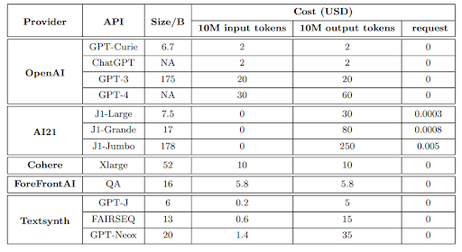
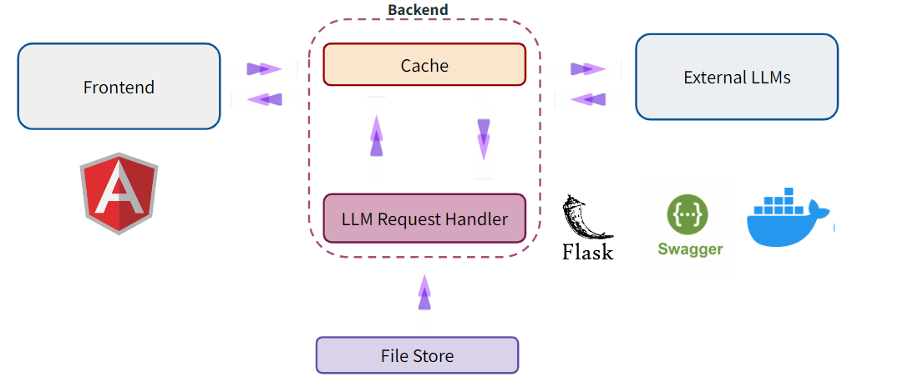
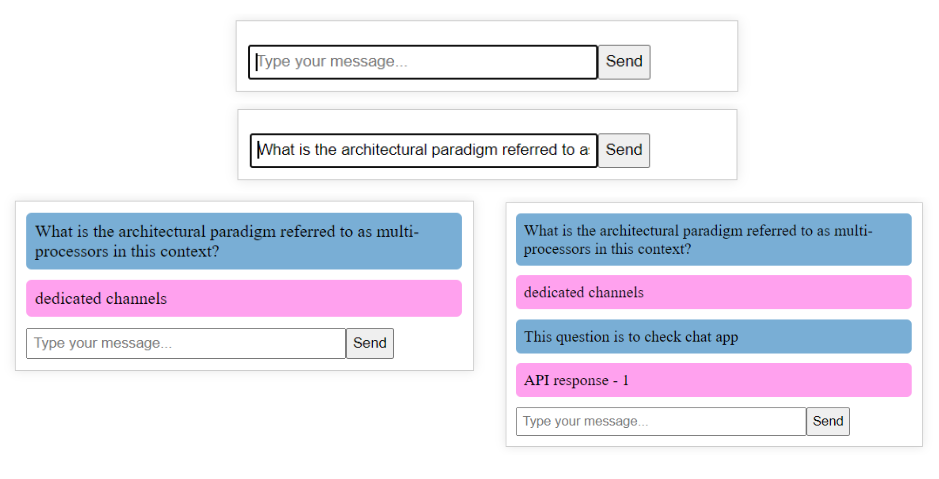

[comment]: # "This is the standard layout for the project, but you can clean this and use your own template"

# Large Language Models in Education

## Table of content

1. [Introduction](#introduction)
2. [Problem and Solution](#problem-and-solution)
3. [Related Works](#related-works)
4. [Methodology](#methodology)
5. [Experiments and Results Analysis](#experiments-and-results-analysis)
6. [Conclusion](#conclusion)
8. [Team](#team)
9. [Supervisors](#supervisors)
10. [Links](#links)

## Introduction
In the last few years, artificial intelligence has advanced significantly, particularly in the fields of generative AI and large language models (LLMs). These cutting-edge models have proven to be exceptionally capable of reading, writing, and producing content that is human-like, opening up new horizons in creativity and invention. These generative AI models provide fascinating prospects in the field of education where technology integration is becoming more common. Intelligent tutoring systems have been sought after in education for a long time to improve and customize students’ learning experiences. The effectiveness of generative AI paired with the current trends in educational technology use offer a potent synergy that has the potential to completely change the educational environment.

The "Large Language Models in Education" addresses many challenges in the educational platforms. Inappropiate responses, privacy concerns, Bias & fairness, high cost, continuous improvement are some of these challenges. A major concern identified is the high cost of accessing Large Language Model APIs. As a solution, "Smart Tutor" has been developed. This cost-effective intelligent tutor focuses on reducing expenses while improving the accuracy of prompts. This prototype relies on a cache implementation with local context and a question-and-answer model to achieve cost reduction. The methodology is implemented for a specific cousre called computer architecture and this prototype can be used for other modules if similar steps are followed. 

## Problem and Soultion
- Problem : High Cost of Accessing LLM APIs
- Solution : Cost Effective Intelligent Tutor

## Related Works
There is a rapidly growing number of large language models (LLMs) that users can query for a fee. We review the cost associated with querying popular LLM APIs like GPT-4, ChatGPT, J1-Jumboand find that these models have heterogeneous pricing structures, with fees that can digger by two orders of magnitude. In particular, using LLMs on large collections of queries and text can be expensive. Motivated by this, we outline and discuss three types of strategies that users can exploit to reduce the inference cost associated with using LLMs.

#### Cost Reduction Methods
- Prompt Selection

- Query Concatenation

- Completion Cache

- Model fine-tuning

- LLM Cascade

The cost of an LLM query increases linearly with the size of the prompt. Consequently, a logical approach to reduce the cost of using LLM APIs involves decreasing the prompt's size, a process we refer to as prompt adaptation. Prompt selection is a natural example of prompt adaptation: rather than employing a prompt containing numerous examples that demonstrate how to perform a task, one can retain a small subset of examples in the prompt. This results in a smaller prompt and subsequently lower cost. An additional instantiation is query concatenation. It is important to note that processing queries individually necessitates sending the same prompt to an LLM API multiple times. Therefore, the fundamental concept of query concatenation involves sending the prompt only once to the LLM API while allowing it to address multiple queries, thereby preventing redundant prompt processing. To accomplish this, several queries must be concatenated into a single query, and the prompt must explicitly request the LLM API to process multiple queries. For instance, to handle two queries using one prompt, the examples presented in the prompt can include both queries followed by their corresponding answers.

The concept of LLM approximation is quite simple: if an LLM API is too costly to utilize, one can approximate it using more affordable models or infrastructures. One example is the completion cache, the fundamental idea involves storing the response locally in a cache when submitting a query to an LLM API. To process a new query, we first verify if a similar query has been previously answered. If so, the response is retrieved from the cache. An LLM API is invoked only if no similar query is discovered in the cache. The completion cache provides substantial cost savings when similar queries are frequently posed. For instance, consider a search engine powered by an LLM API. If numerous users search for the same or similar keywords simultaneously, the completion cache facilitates answering all their queries by invoking the LLM only once. Another example of LLM approximation is model fine-tuning. This process consists of three steps: first, collect a powerful but expensive LLM API's responses to a few queries; second, use the responses to fine-tune a smaller and more affordable AI model; and finally, employ the fine-tuned model for new queries. In addition to cost savings, the fine-tuned model often does not require lengthy prompts, thus providing latency improvements as a byproduct. The increasing availability of LLM APIs with heterogeneous performance and costs presents a unique opportunity for data-adaptive LLM selection. Different LLM APIs have their own strengths and weaknesses for various queries. Consequently, appropriately selecting which LLMs to use can provide both cost reduction and performance improvements. LLM cascade is one such example. LLM cascade sends a query to a list of LLM APIs sequentially. If one LLM API's response is reliable, then its response is returned, and no further LLMs in the list are needed. The remaining LLM APIs are queried only if the previous APIs' generations are deemed insuffciently reliable. Query cost is significantly reduced if the first few APIs are relatively inexpensive and produce reliable generations.

Combining approaches within and across different strategies can lead to further cost reduction and performance enhancement. For instance, joint prompt and LLM selection is a composition of prompt selection and LLM cascade: for a given query, it searches for the smallest prompt and most affordable LLM that achieves satisfactory task performance. Another example is to search across both existing LLM APIs and fine-tuned models. It is important to note that the composition of different approaches also increases the computational costs for training. Consequently, this paves the way for investigating trade-offs between query costs, task performance, and computational costs.

FrugalGPT is a simple yet exible instantiation of LLM cascade which learns which combinations of LLMs to use for different queries in order to reduce cost and improve accuracy. The experiments show that FrugalGPT can match the performance of the best individual LLM (e.g. GPT-4) with up to 98% cost reduction or improve the accuracy over GPT-4 by 4% with the same cost.

#### Cost Measurement
Cost of LLM APIs based on
- Number of input Tokens (unit of text)
- Number of output Tokens
- Fixed cost per Request

##### Summary of commercial LLM APIs

##### FrugalGPT Strategy

##### Overall Performance of a Query & a Response

#### Methods of making an intelligent Tutor
- Personalize instruction: LLMs can be used to generate personalized feedback for each student, based on their individual needs and learning style.
- Provide real-time assistance: LLMs can be used to provide real-time assistance to students, as they are working on problems.
- Generate engaging content: LLMs can be used to generate engaging content, such as interactive simulations and games, that can help students learn more effectively.

## Methodology
#### Step 01. Create High Level Solution Architecture

#### Step 02. Plan System Data flow

#### Step 03. Collect Course Materials and Create Datasets
"Computer Architecture" course materials are collected and the datasets are created manually. As an example "computer architecture" is selected. This complete protype can be used any other course if the similar steps are followed in the implementation.

#### Step 04. QA Model Implementation
- Get prebuild Question Answering Models
- Train the models using datasets
- Use a threshold value(0.5) to check the highest scored answer
- Get the most suitable QA model using the highest accuracy

#### Step 05. Create Similarity Checker
- Cosine similarity function is used
- Send the vector to similarity checker
- Check all the summaries and select the most appropiate passage
- Send that passage and prompt to QA model

#### Step 06. Cache Implementation
- LFU (Least Frequently Used) Eviction Policy is used
- Replace the prompt which is least frequently used
- Extract vector and and check that vector has an answer already

#### Step 07. Backend Implemenatation
- Get prompt with category
- all-MiniLM-L6-v2 model is used to encode the prompt to a vector
- Send the vector to cache
- If the cache does not have the vector send it to similarity checker and then send it to QA model
- Get the answer from QA model
- Update cache

#### Step 08. Frontend Implemenatation
- Create small chat application using Angular

#### Step 09. Integration
Integrate the Frontend, backend, cache, similarity checker and QA model implementations.

#### Step 09. Testing
Test the chat application with different prompts.

## Experiments & Results Analysis
#### Create custom QA models
- bert → bert-base-cased
- electra-base → google/electra-base-discriminator
- roberta → roberta-base
- distilbert → distilbert-base-cased
- distilroberta → distilroberta-base
- electra-small → google/electra-small-discriminator
- xlnet → xlnet-base-cased

From the results, the QA model which gives the highest accuracy is selected. "bert-base-uncased-squad2" model gives the highest accuracy. So that model was selected to get the answer.

#### Test cache implementation
- There should be 4 blocks in the cache.
- After many API calls the access count of the prompt is increased in the cache.
- Then observe the replacement of the new prompt with the prompt which has the least number of access counts.

## Conclusion
The deliverable of the project is a prototype which is capable of integrating with any course materials with a custom based memory (Local Context) instead of a frozen memory. This prototype has the ability of integrating any QA model, checking the accuracy and getting the highest scored answers for prompts. And finally, the number of API calls are reduced using cache, specially, because most of the time the users are asking the similar questions and because of that there will always be cache hits. From that situation, the number of API calls are reduced.

#### Team

- E/17/297, Rupasinghe T. T. V. N., [e17297@eng.pdn.ac.lk](mailto:e17297@eng.pdn.ac.lk)
- E/17/206, Manohora H. T., [e17206@eng.pdn.ac.lk](mailto:e17206@eng.pdn.ac.lk)
- E/17/148, Kalpana M. W. V., [e17148@eng.pdn.ac.lk](mailto:e17148@eng.pdn.ac.lk)

#### Supervisors

- Dr. Damayanthi Herath, [damayanthiherath@eng.pdn.ac.lk](mailto:damayanthiherath@eng.pdn.ac.lk)
- Prof. Roshan G. Ragel, [roshanr@eng.pdn.ac.lk](mailto:roshanr@eng.pdn.ac.lk)
- Dr. Isuru Nawinne, [isurunawinne@eng.pdn.ac.lk](mailto:isurunawinne@eng.pdn.ac.lk)
- Dr. Shamane Siriwardhana, [gshasiri@gmail.com](mailto:gshasiri@gmail.com)

#### Links

- [Project Repository](https://github.com/cepdnaclk/e17-4yp-Large-Language-Models-in-Education/){:target="_blank"}
- [Project Page](https://cepdnaclk.github.io/e17-4yp-Large-Language-Models-in-Education/){:target="_blank"}
- [Department of Computer Engineering](http://www.ce.pdn.ac.lk/)
- [University of Peradeniya](https://eng.pdn.ac.lk/)

[//]: # (Please refer this to learn more about Markdown syntax)
[//]: # (https://github.com/adam-p/markdown-here/wiki/Markdown-Cheatsheet)

